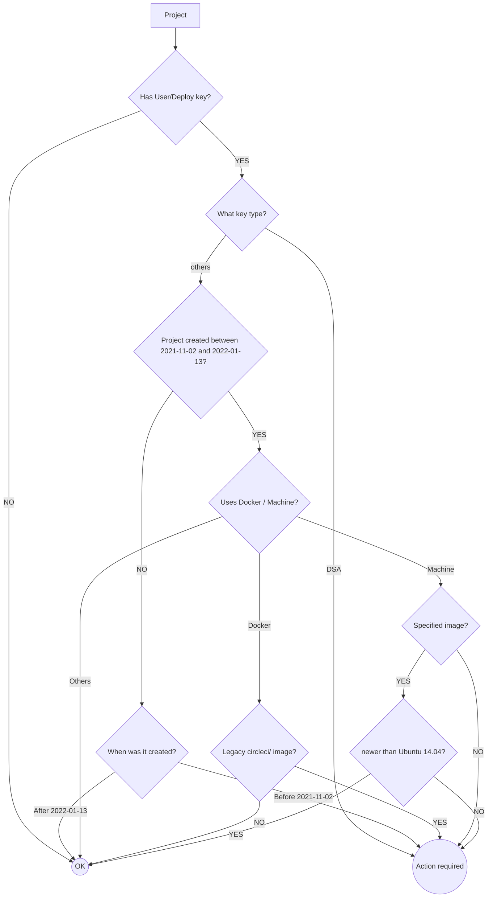

# github-ssh-key-deprecation-notes

Making sense of relevant information around [the GitHub SSH Key Deprecation](https://github.blog/2021-09-01-improving-git-protocol-security-github/)

## CircleCI users

For CircleCI users, we may want to refer to this Discussion post:
https://discuss.circleci.com/t/github-ssh-deprecation-information-resolutions/42887

However, I tend to be more of a visual person.
So, I wonder if we can craft the information above to a flowchart to determine if we need to take action for any CircleCI project.

**Note:** for action required, it can include verifying the SSH key type as a first step.
